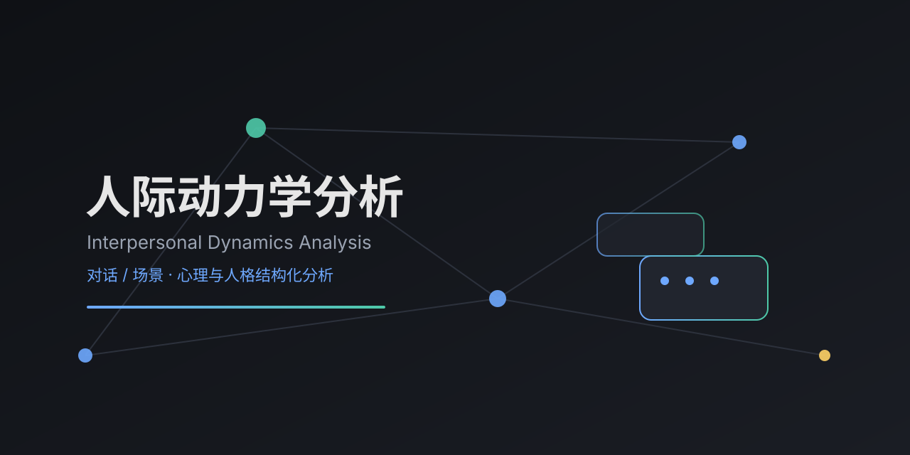

# 人际动力学分析 · Interpersonal Dynamics Analysis

> 一个用于**对话与场景人际心理 / 人格结构化分析**的 WorkBuddy Skill。把聊天截图、聊天记录或一段关系 / 冲突场景，转化为**可溯源、可复核**的心理画像与互动结构模型——而非简单的内容摘要。



## ✨ 功能点

- **多轮累积分析**：可分多轮补充素材（截图 → 故事 → 澄清），每轮证据按序编号并合并进既有画像（强化或修正）
- **证据溯源系统**：所有结论挂来源标记（`R1`/`N1`/`B`/`Q1`/`Y-*`/`S`），可复核、可修正
- **四维行为分析**：对每一方独立拆解 **沟通模式 / 情感模式 / 冲突处理 / 自我叙事**
- **双轴结构模型**：用「获取轴 × 付出轴 × 自保」压缩人格运作方式，并置对比识别对称 / 镜像 / 错配
- **双向互动闭环**：串出双方循环，钉死"触发点在谁"
- **排除性诊断**：对 NPD / 煤气灯 / 精致利己等标签做**反向排除论证**，标注"模式识别，非临床"
- **澄清与诚实修正**：关键事实不清时用结构化提问；收到回答后**诚实标注**原判断被推翻
- **心态演变时间线**：跨时段素材看心态随外部事件的演变
- **行为红旗清单**：可勾选复核的红旗 + 用户自查项
- **关系操作建议**：仅建议、不替决定，关系决策权归属用户
- **类型匹配（MBTI / 八维）**：启发式推测沟通 gap，明确"非测评"

## 🎯 适用场景

- 提供聊天截图 / 记录，想弄清"他是什么意思""我们沟通哪里出问题"
- 描述冲突 / 关系场景，分析对方心理 / 动机 / 人格
- 做对象画像、伴侣适配、软肋与拿捏分析
- 怀疑对方 NPD / 煤气灯 / 精致利己，需要专业辨析

## 🚫 不适用

- 纯技术 / 代码 / 数据任务
- 对未成年人性化或政治敏感内容（按政策拒绝）
- 用户处于急性心理危机（引导专业求助，而非人格分析）
- 用户只要翻译 / 总结、明确不要人格分析

## 📦 安装

将本仓库放入 WorkBuddy 的 skills 目录（用户级或项目级）：

```bash
# 用户级
~/.workbuddy/skills/interpersonal-dynamics-analysis/

# 或项目级
{workspace}/.workbuddy/skills/interpersonal-dynamics-analysis/
```

放入后，对话中表达分析意图即可触发。

## 🛠 用法

1. 发送聊天截图 / 聊天记录 / 一段关系场景描述
2. Skill 调用 OCR（图片）或逐条转写，还原对话
3. 按「四维 + 双轴 + 闭环 + 排除诊断」产出 HTML 图文报告并预览
4. 你可继续补充素材，画像随证据累积逐步强化或修正

## 🧭 方法论概览

| 模块 | 内容 |
|------|------|
| 0 | 多轮累积与隐私自护（贯穿全程） |
| 1 | 证据溯源标记系统 |
| 2 | 四维行为分析（每方独立） |
| 3 | 双轴结构模型 |
| 4 | 双向 / 多方互动闭环 |
| 5 | 排除性诊断 |
| 6 | 澄清与修正 |
| 7 | 心态演变时间线 |
| 8 | 行为红旗清单 |
| 9 | 关系操作建议 |
| 10 | 类型匹配（MBTI / 八维） |

## 🔒 隐私与安全（重要）

- **绝不留存用户原始素材**：不写文件、不缓存、不回传对话 / 截图到任何外部服务
- **主动脱敏**：接收素材时提示用户先隐去姓名、精确地点、机构名、独特事件
- **报告可去个人化**：要求转发时生成去除所有可识别信息的版本
- **非临床诊断**：所有结论为模式识别，不构成医学 / 心理诊断
- **不替代专业帮助**：急性心理危机时引导寻求专业机构

## 📁 目录结构

```
interpersonal-dynamics-analysis/
├── SKILL.md                      # 方法论与触发规则
├── references/
│   ├── analysis_checklist.md     # 执行前自检清单
│   └── report_template.html      # 报告骨架模板（{{占位符}}）
├── README.md
├── LICENSE
├── .gitignore
└── banner.svg
```

## 📄 License

[MIT](LICENSE) © 2026 {{GITHUB_USERNAME}}
